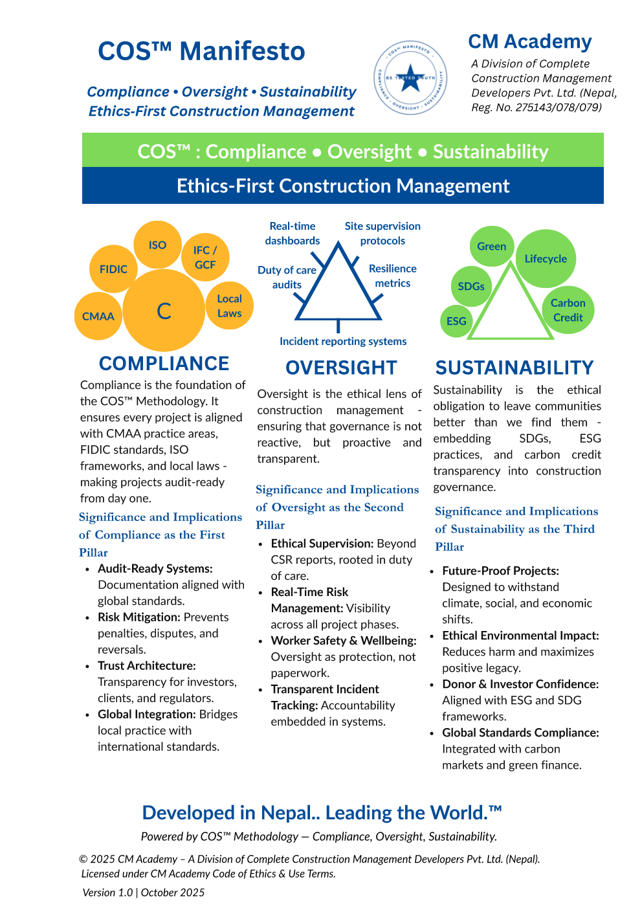
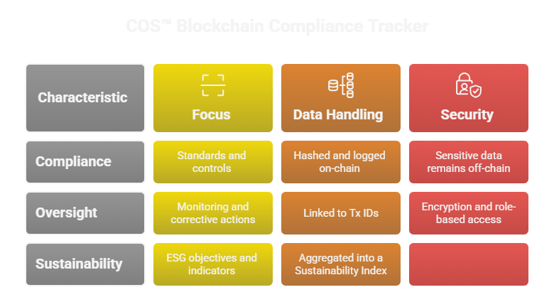
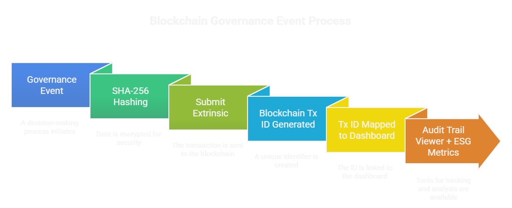

🏆 Hackathon Context  
Submitted to the Polkadot Global Hackathon 2025 (Sub0) — Governance & Compliance Track as a prototype demonstrating ethics‑first compliance logging using Polkadot.js and Westend/Paseo testnets.

## 🚀 Quick Start
1. Open https://polkadot.js.org/apps (Westend/Paseo).
2. Copy a Tx ID from /appendix/audit_table.csv.
3. Paste into the explorer, verify block number and account.
4. Review /docs/ethics_statement.md for governance commitments.

# COS™ Blockchain Tracker: Ethics‑First Compliance Logging for Infrastructure Governance  

**Author:** Susil Bhandari  
**Affiliations:** CM Academy; NeoPlan Consult Pvt. Ltd., Nepal  
**Version:** Working Paper v1.1 (November 2025)  
**DOI:** https://doi.org/10.5281/zenodo.17620309  

---

## 📘 Abstract  
Donor‑funded infrastructure projects often face fragmented compliance records, weak oversight, and limited transparency in sustainability reporting. The **COS™ Blockchain Compliance Tracker** integrates the Compliance, Oversight, and Sustainability (COS™) framework with blockchain‑based logging to create **immutable, verifiable audit trails**.  

Proof‑of‑concept demonstrations on Westend/Paseo testnets confirm feasibility, with **Tx IDs serving as audit‑ready references**. The system enhances trust for donors, reduces risks for project managers, and assures communities of **ethical and sustainable project delivery**.  

---

## 📊 COS Audit Tracker — On‑Chain Proofs  
All COS™ audit events have now been immutably logged on the **Westend Asset Hub** using `system.remark` extrinsics from the **COS DEMO ACCOUNT (Talisman)**.  

| Project ID | Milestone / Audit Event           | ESG Metric         | Date         | Responsible Party | Status            | Hash (SHA‑256)                                      | Blockchain Tx ID                                                                 |
|------------|-----------------------------------|---------------------|--------------|-------------------|-------------------|----------------------------------------------------|----------------------------------------------------------------------------------|
| Project001 | Safety inspection completed       | Worker Safety       | 11 Nov 2025  | Auditor           | On‑chain verified | `18de905f72c92a9fb895c6092ce6c01c9efb4c209fecc9853633adca6dd8575e` | `0x810bc37c9f51821e3361b0a57b224bbe0e0cbd56843098589da26f888222c2ec` (Block #13,205,983, Account: `5GxB6wrAz...`) |
| Project002 | Environmental permit approved     | Carbon Emissions    | 10 Nov 2025  | Govt Authority    | On‑chain logged   | `1077d72e31a9945bc3c71fe9f6a976ae6fde12149c331a7b4010eebc3af1782e` | `0x1077d72e31a9945bc3c71fe9f6a976ae6fde12149c331a7b4010eebc3af1782e` (Block #13,206,001, Account: `5GxB6wrAz...`) |
| Project003 | Donor compliance report filed     | Gender Inclusion    | 09 Nov 2025  | Project Manager   | On‑chain submitted| `3160f66170b885c767ba4bb24eb75f156923854ac89cfbd77a474d3e92184dcd` | `0x0000803160f66170b885c767ba4bb24eb75f156923854ac89cfbd77a474d3e92184dcd` (Block #13,206,019, Account: `5GxB6wrAz...`) |

📂 Screenshots and decode proofs are stored in `/appendix/screenshots/`.

---

📂 Repository Contents
- [/paper](paper/) – Full working paper (PDF)
- [/figures](figures/) – Diagrams and dashboard visuals
- [/appendix](appendix/) – Tx IDs, commands, screenshots
- [/docs](docs/) – Roadmap, ethics statement, references
- [README.md](README.md) – Project overview and citation

---

🔗 Citation  
Bhandari, S. (2025). COS™ Blockchain Tracker: Ethics‑First Compliance Logging for Infrastructure Governance. CM Academy Working Papers Series, 1(1), 1–14. Zenodo. https://doi.org/10.5281/zenodo.17620309  

---

## 🌍 License & Copyright  
© 2025 Susil Bhandari & CM Academy. COS™ is a registered trademark.  
This work is licensed under Creative Commons Attribution 4.0 International (CC BY 4.0).  
DOI: https://doi.org/10.5281/zenodo.17620309

---

## 🚀 Roadmap  
- Hackathon prototype (Nov 2025)  
- Pilot deployment with donor agency (2026)  
- CM Academy training modules  
- Global certification ecosystem  

---

## 🏆 Strategy: Ethics‑First Approach  
The COS™ Tracker is built on three pillars:  

- **Compliance:** Immutable audit trails tied to ESG milestones.  
- **Oversight:** Transparent governance with verifiable Tx IDs.  
- **Sustainability:** Ethical assurance for communities and donors.  

This ethics‑first methodology positions COS™ as a **pathfinder for global governance innovation**, ensuring that blockchain is not just a technical tool but a **cultural commitment to integrity and trust**.  

---

## 📊 Visual Methodology

  
*Figure 1: Ethics-first governance framework developed by CM Academy.*

  
*Figure 2: Operational mapping of COS™ principles to blockchain functions.*

  
*Figure 3: Stepwise process for converting governance events into immutable blockchain records.*

---

## 🔑 Keywords  
Governance · ESG · Blockchain · Compliance · Audit trail · Donor transparency · Ethics‑first  

---

## 📚 Supporting Documentation
- [/docs/roadmap.md](docs/roadmap.md) – Development phases and milestones  
- [/docs/ethics_statement.md](docs/ethics_statement.md) – Data protection and governance principles  
- [/docs/references.bib](docs/references.bib) – Academic references in BibTeX format  
